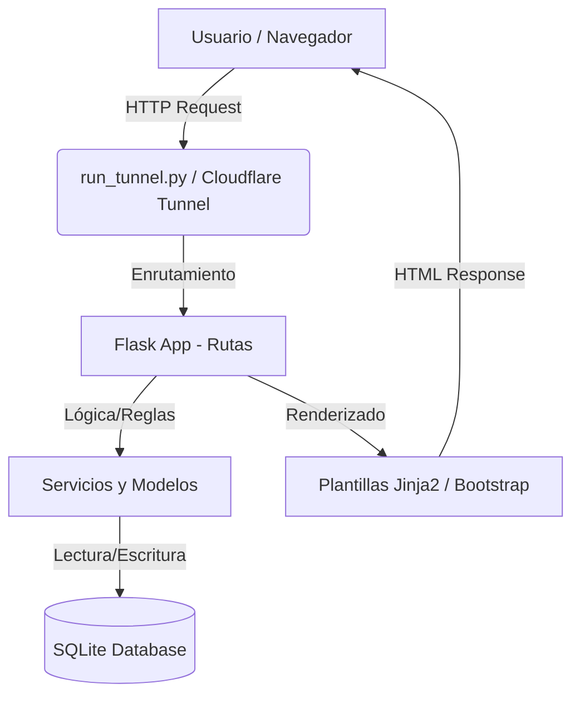
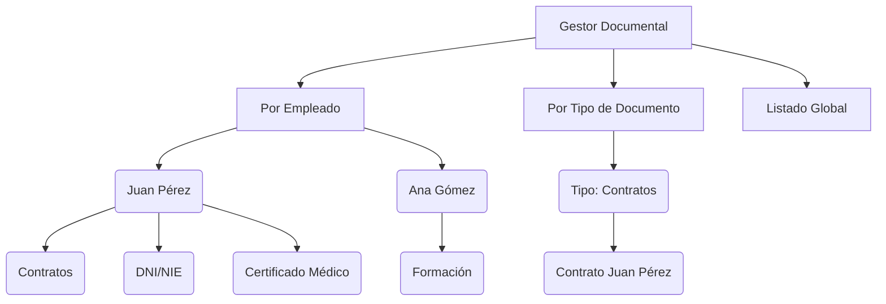

# Estructura tecnica del proyecto: Gestion PRL

Este documento explica como esta construida la aplicacion hoy: arquitectura, capas, flujo de datos, autenticacion y despliegue.

## 1) Tipo de aplicacion

- Es una aplicacion web monolitica en Flask.
- Tiene backend (Python/Flask/SQLAlchemy) y frontend renderizado en servidor (Jinja2 + Bootstrap).
- No es una API REST pura.
- Incluye un endpoint JSON puntual para UI: `GET /api/buscar-empleado`.

## 1.1) Diagrama de Arquitectura Simplificado



## 2) Stack tecnico

- Backend: Flask
- ORM y datos: Flask-SQLAlchemy
- Base de datos: SQLite (`instance/prl.db`)
- Auth de sesion: Flask-Login
- Correos: Flask-Mail
- Tareas programadas: APScheduler
- Informes: ReportLab (PDF) + CSV
- Exposicion publica opcional: `pycloudflared` (Cloudflare Tunnel)

## 3) Arranque oficial

Unico punto de entrada:

```powershell
.\.venv\Scripts\activate
python run_tunnel.py
```

`run_tunnel.py` permite dos modos:

- `1` local (red local)
- `2` publico (Cloudflare Tunnel)

## 4) Estructura de carpetas (real)

```text
PythonProject/
|-- ESTRUCTURA_PROYECTO.md
|-- requirements.txt
|-- run_tunnel.py
|-- seed.py
|-- app/
|   |-- __init__.py
|   |-- config.py
|   |-- extensions.py
|   |-- models.py
|   |-- routes/
|   |   |-- __init__.py
|   |   |-- auth.py
|   |   |-- dashboard.py
|   |   |-- document_types.py
|   |   |-- documents.py
|   |   |-- employees.py
|   |   |-- file_manager.py
|   |   |-- notifications.py
|   |   `-- reports.py
|   |-- services/
|   |   |-- __init__.py
|   |   `-- report_service.py
|   |-- static/
|   |   `-- uploads/
|   |-- templates/
|   |   |-- base.html
|   |   |-- auth/
|   |   |-- dashboard/
|   |   |-- document_types/
|   |   |-- documents/
|   |   |-- employees/
|   |   |-- file_manager/
|   |   |-- notifications/
|   |   `-- reports/
|   `-- utils/
|       |-- __init__.py
|       `-- decorators.py
`-- instance/
    `-- prl.db
```

## 5) Arquitectura por capas

### 5.1 Entrada y bootstrap

- `run_tunnel.py`: inicia la app y selecciona modo local/publico.
- `app/__init__.py`:
  - crea `Flask app` (`create_app`),
  - carga configuracion,
  - inicializa extensiones,
  - registra blueprints,
  - crea tablas si no existen,
  - levanta scheduler para notificaciones.

### 5.2 Capa web (controladores)

En `app/routes/` cada modulo define rutas HTTP y reglas de acceso:

- `auth.py`: login, logout, registro, perfil y `api/buscar-empleado`.
- `dashboard.py`: panel principal por rol.
- `employees.py`: gestion de empleados (admin).
- `documents.py`: listado/alta/edicion de documentos.
- `document_types.py`: catalogo de tipos de documento.
- `reports.py`: generacion de informes.
- `notifications.py`: historial y utilidades de notificacion.
- `file_manager.py`: vista documental avanzada por empleado y por tipo.

### 5.3 Capa de dominio y persistencia

- `app/models.py` define entidades clave:
  - `User`
  - `Employee`
  - `DocumentType`
  - `Document`
  - `NotificationLog`
- Persistencia en SQLite (`instance/prl.db`) mediante SQLAlchemy.

### 5.4 Capa de servicios

- `app/services/report_service.py`: logica de exportacion de informes.
- `app/services/__init__.py`:
  - busqueda de documentos proximos a caducar,
  - envio de email,
  - registro de resultado en `NotificationLog`.

### 5.5 Capa de presentacion

- `app/templates/`: HTML por modulo con Jinja2.
- `app/static/uploads/`: archivos subidos por usuarios.

## 6) Frontend: como esta hecho

- Renderizado principal en servidor (SSR) con Jinja2.
- Base visual en Bootstrap.
- JS ligero para interacciones puntuales (por ejemplo, validacion dinamica en registro).
- No hay SPA ni framework frontend dedicado (React/Vue/Angular).

## 7) Backend/API: como esta hecho

- Predominan rutas HTML + formularios.
- Hay endpoint API puntual JSON (`/api/buscar-empleado`) consumido desde la pantalla de registro.
- La app usa sesion de usuario (cookie de Flask-Login), no JWT.

## 8) Flujo de datos tipico

1. Navegador envia request HTTP a una ruta Flask.
2. Blueprint aplica autenticacion/autorizacion (`@login_required`, `@admin_required`).
3. Se consulta o actualiza BD via modelos SQLAlchemy.
4. Se devuelve HTML renderizado (Jinja2) o JSON en casos puntuales.
5. Si hay subida de archivo, se guarda en `app/static/uploads/` y se persiste la referencia en `Document`.

## 9) Autenticacion y autorizacion

- Autenticacion por usuario/clave con Flask-Login.
- Dos roles funcionales:
  - `admin`: gestion global.
  - `empleado`: acceso restringido a sus datos/documentos.
- Registro de empleados vinculado a su DNI/NIE cargado previamente por admin.

## 10) Organizacion de documentos

La clasificacion principal es por empleado.

- En `file_manager`, cada empleado actua como contenedor principal.
- Dentro del empleado, se agrupa por `DocumentType`.
- Existe vista transversal por tipo (`file_manager/by_type`).
- En `documents`, hay listado global con filtros por estado, tipo y empleado.

No existe entidad de "grupo" empresarial como primer nivel de clasificacion en el modelo actual.

### Jerarquía Documental (Diagrama)



## 11) Notificaciones y tareas programadas

- `APScheduler` se inicializa en `create_app`.
- Job diario revisa documentos que caducan en ventanas configuradas (30, 15, 7, 1 dias).
- Se envian correos y se registra trazabilidad en `NotificationLog`.

## 12) Semillas y entorno de datos

- `seed.py` inicializa tablas y crea datos de ejemplo (admin, empleados, tipos, documentos).
- Credencial admin por defecto: `admin / admin123` (entorno de ejemplo/desarrollo).

## 13) Despliegue actual

- Uso previsto: ejecucion local de Flask.
- Exposicion a Internet: Cloudflare Quick Tunnel lanzado desde `run_tunnel.py`.
- Es una exposicion temporal mientras el proceso esta vivo (no hosting permanente gestionado).

## 14) Mantenimiento

Cuando cambie codigo o estructura:

1. Actualizar este documento (`ESTRUCTURA_PROYECTO.md`).
2. Verificar arranque con `python run_tunnel.py`.
3. Comprobar rutas clave (`/login`, dashboard, documentos, gestion documental).

## 15) Seguridad y protecciones basicas (local)

- Limites de tasa en memoria para rutas sensibles (login/registro/verificacion).
- Cookies de sesion con `HTTPOnly` y `SameSite=Lax`.
- Cabeceras de seguridad basicas (X-Frame-Options, X-Content-Type-Options, etc.).
- Registro de eventos de seguridad en `logs/app.log`.
- Recomendado: restringir la red (firewall/IPs internas) y usar HTTPS si es posible.

### 15.1 Ajustes por entorno (.env)

- `SESSION_COOKIE_SECURE=true` si usas HTTPS.
- `RATE_LIMIT_*` para ajustar limites.
- `SECURITY_LOG_PATH` para cambiar la ruta del log.
